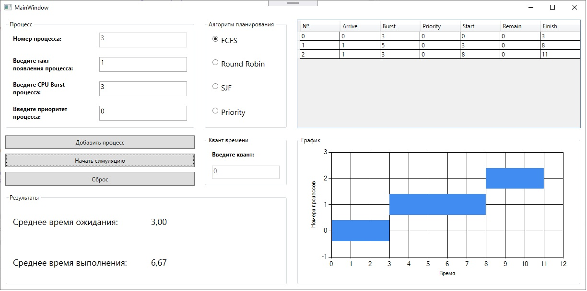
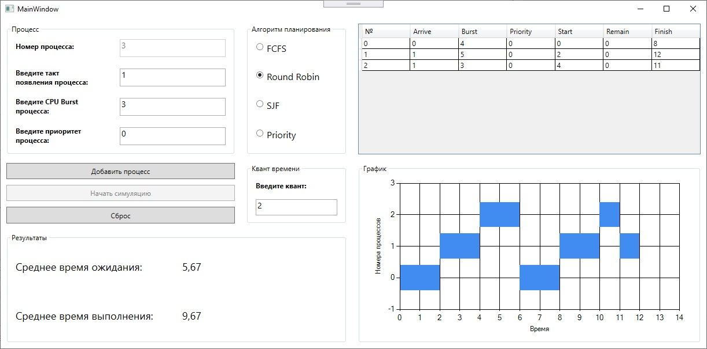
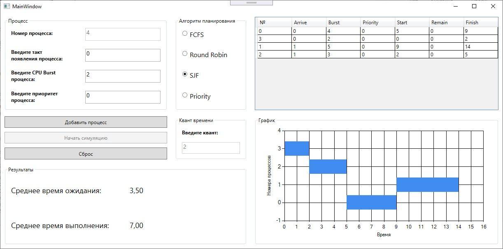
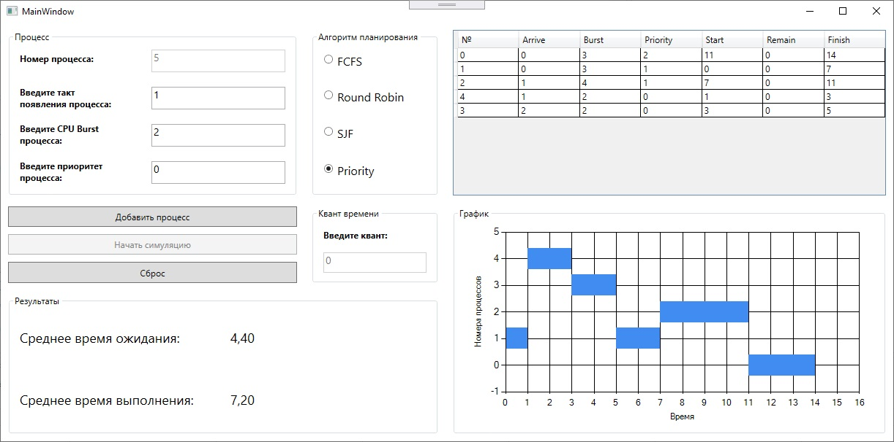
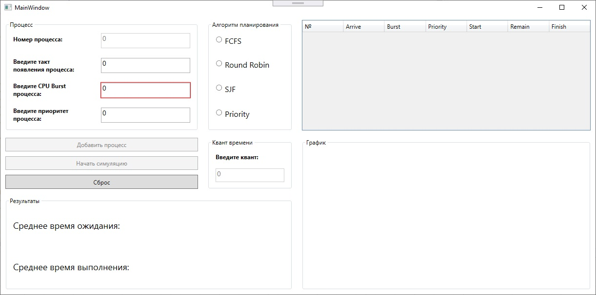
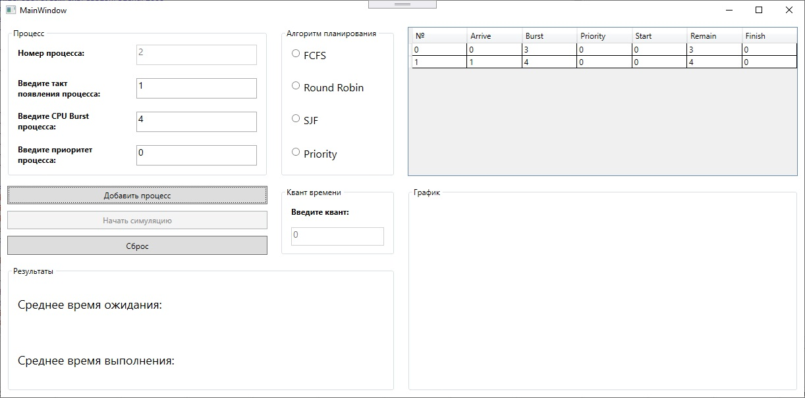
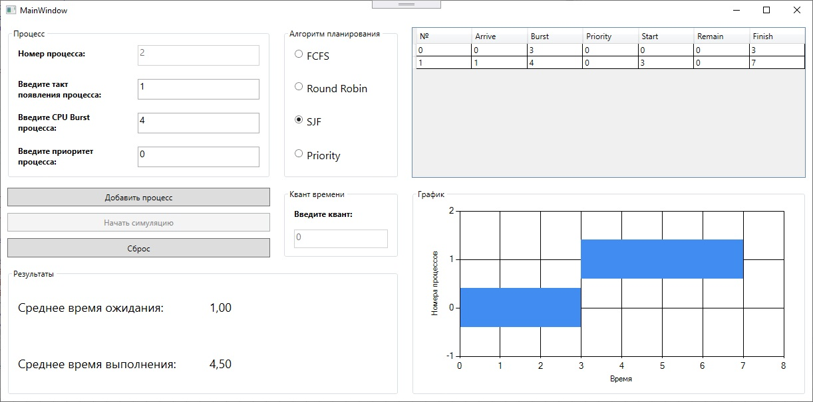
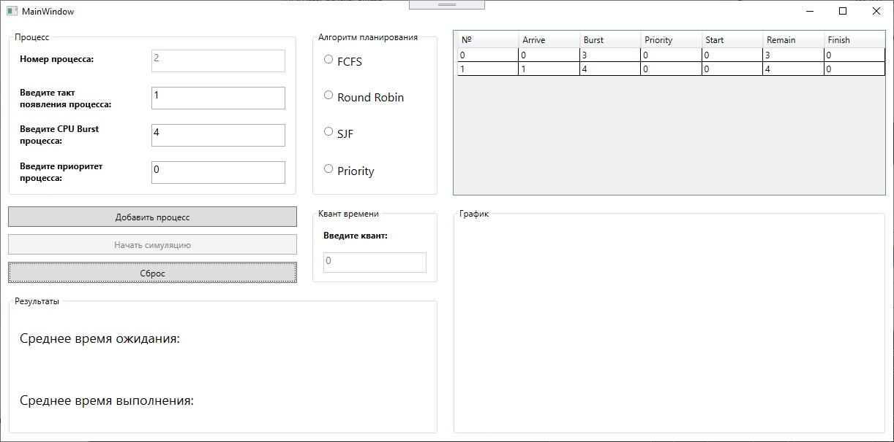

# Алгоритмы планирования процессов
Приложение на платформе WPF, позволяющее симулировать работу алгоритмов
FCFS, Round Robin, SJF, Priority. Результат работы выбранного алгоитма
планирования представлен в виде Столбчатой диаграммы.

**[HELP](#help)**

## Основные понятия планирования процессов
***Планирование*** - обеспечение поочередного доступа процессов 
к одному процессору.

***Планировщик*** - отвечающая за это часть операционной системы.

***Алгоритм планирования*** - используемый алгоритм для 
планирования.

***Алгоритм планирования без переключений (неприоритетный)*** - не 
требует прерывание по аппаратному таймеру, процесс останавливается
только когда блокируется или завершает работу.

***Алгоритм планирования с переключениями (приоритетный)*** - требует 
прерывание по аппаратному таймеру, процесс работает только 
отведенный период времени, после этого он приостанавливается 
по таймеру, чтобы передать управление планировщику.

##Задачи алгоритмов планирования
1. **Для всех систем**

   _Справедливость_ - каждому процессу справедливую долю процессорного времени
   
   Контроль над выполнением принятой политики
   
   _Баланс_ - поддержка занятости всех частей системы (например: чтобы были заняты процессор и 
   устройства ввода/вывода)

2. **Системы пакетной обработки**

   _Пропускная способность_ - количество задач в час
   
   _Оборотное время_ - минимизация времени на ожидание обслуживания и обработку задач.
   
   _Использование процесса_ - чтобы процессор всегда был занят.

3. **Интерактивные системы**

   _Время отклика_ - быстрая реакция на запросы
   
   _Соразмерность_ - выполнение ожиданий пользователя (например: пользователь не готов к долгой загрузке системы)

4. **Системы реального времени**

   _Окончание работы к сроку_ - предотвращение потери данных
   
   _Предсказуемость_ - предотвращение деградации качества в мультимедийных системах (например: 
   потерь качества звука должно быть меньше чем видео)
   
##Алгоритмы планирования
###FCFS
FCFS (first come – first serve; первым пришел – первым обслуживается) – простейший алгоритм, работа, которой понятна из ее названия. Это алгоритм без вытеснения, то есть процесс, выбранный для выполнения на ЦП, не прерывается, пока не завершится (или не перейдет в состояние ожидания по собственной инициативе). FCFS обеспечивает минимум накладных расходов. Среднее потерянное время при применении этого алгоритма не зависит от длительности процесса, но штрафное отношение при равном
потерянном времени будет большим для коротких процессов. Поэтому алгоритм FCFS
считается лучшим для длинных процессов. Существенным достоинством этого алгоритма наряду с его простотой является то обстоятельство, что FCFS гарантирует отсутствие
бесконечного откладывания процессов: любой поступивший в систему процесс будет, в
конце концов, выполнен независимо от степени загрузки системы.

###Round Robin
RR (round robin – карусель) – простейший алгоритм с вытеснением. 
Процесс получает в свое распоряжение ЦП на некоторый квант 
времени Q (в простейшем случае размер кванта фиксирован). 
Если за время Q процесс не завершился, он вытесняется из
ЦП и направляется в конец очереди готовых процессов, где 
ждет выделения ему следующего кванта, и т.д. Показатели 
эффективности RR существенно зависят от выбора величины кванта Q. 
RR обеспечивает наилучшие показатели, если длительность 
большинства процессов приближается к размеру кванта, но не 
превосходит его. Тогда большинство процессов укладываются в 
один квант и не становятся в очередь повторно.

###SJF
SJF (shortest job first – самая короткая работа – первой) – 
невытесняющий алгоритм, в котором наивысший приоритет имеет 
самый короткий процесс. Для того чтобы применять этот алгоритм, 
должна быть известна длительность процесса – задаваться
пользователем или вычисляться методом экстраполяции. 
Для коротких процессов SJN обеспечивает лучшие показатели, 
чем RR, как по потерянному времени, так и по штрафному отношению. 
SJN обеспечивает максимальную пропускную способность системы –
выполнение максимального числа процессов в единицу времени, 
но показатели для длинных процессов значительно худшие, а при 
высокой степени загрузки системы активизация длинных процессов 
может откладываться до бесконечности. 

###Priority
Алгоритм SJF представляет собой частный случай приоритетного 
планирования. При приоритетном планировании каждому процессу 
присваивается определенное числовое значение - приоритет, в 
соответствии с которым ему выделяется процессор. Процессы с 
одинаковыми приоритетами планируются в порядке FCFS. Для 
алгоритма SJF в качестве такого приоритета выступает оценка 
продолжительности следующего CPU burst. Чем меньше значение 
этой оценки, тем более высокий приоритет имеет процесс. 

#HELP
Окно программы имеет три области:
* Процесс
* Алгоритм планирования
* Квант времени (для Round Robin)
* Таблица с процессами
* График
* Результаты

В области процесс задается такт его появления, CPU Burst, приоритет
(в случае если будет использоваться алгоритм Priority, в выполнении
других алгоритмов планирования это значение роли не играет).

После ввода корретных значений активируется кнопка "Добавить процесс",
нажатие на которую приводит к добавлению процесса в таблицу.

После того, как необходимые процессы добавлены, нужно выбрать алгоритм
планирования. Активируется кнопка "Начать симуляцию", которая
позволяет отобразить Столбчатую диаграмму, на которой по оси
абцисс располагаются такты времени, а по оси ординат - номера процессов.

В области Результатов показано среднее время ожидания процессов и 
среднее время выполнения. Также в таблице отобразится тик начала
выполнения процесса в графе Start и тик окончания в графе Finish.

Чтобы изменить алгоритм планирования или добавить другие процессы,
нужно нажать кнопку Сброс. При этом ранее добавленные процессы не
удалятся, удалить их можно путем выделения в таблице и нажатия
клавиши Delete.

После сброса можно добавить процессы, заново выбрать алгоритм
планирования и вновь симулировать процесс работы выбранного алгоритма.